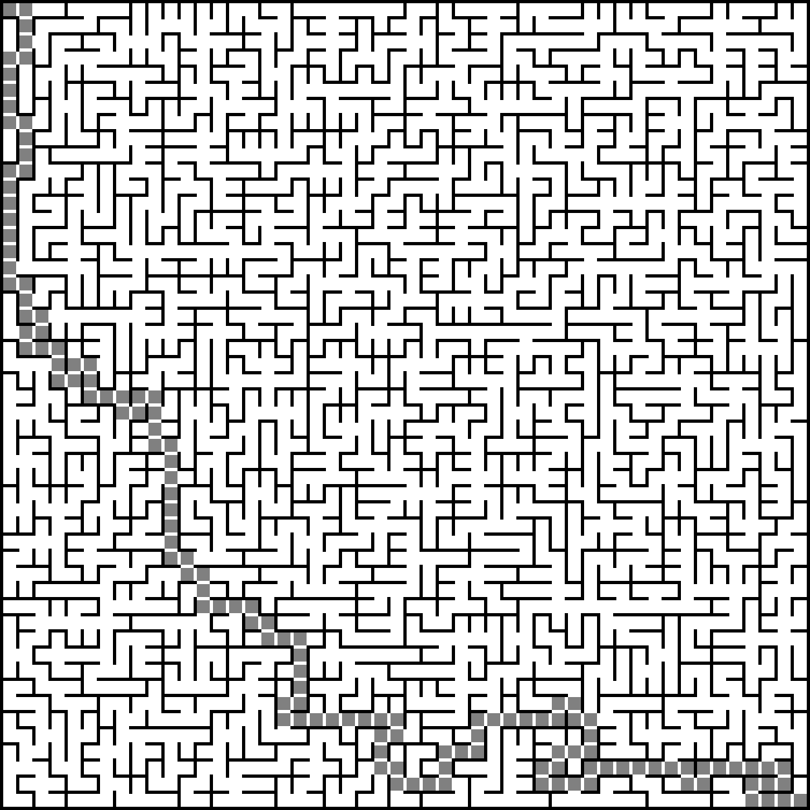

# Parallel Maze Generator/Solver

Small project for a parallel programming assignment. Generates a random maze with Kruskal's algorithm, then solves it with BFS, comparing a plain serial solve against a threaded version and a multiprocessing version to see if either one actually helps.



## What's here

- `serial/maze-serial.py` - baseline, generates a maze and solves it with normal BFS, no concurrency at all.
- `parallel/maze-parallel.py` - same idea but the neighbor exploration during BFS runs through a ThreadPoolExecutor.
- `parallel/maze-parallel-processes.py` - uses ProcessPoolExecutor + multiprocessing.Manager instead of threads.
- `parallel_maze.py` - builds one maze and times serial vs threaded solve back to back on it, for a direct comparison.
- `serial_vs_parallel/main.py` - bigger version (1000x1000 grid), runs the threaded solve with 2/4/8/16 workers and prints all the timings, also saves `maze_solve_comparison.png`.

## How the maze gets built

Every cell is a node. All edges between neighboring cells get shuffled and added back one at a time with a disjoint-set (union-find) - an edge only gets kept if the two cells aren't already connected, otherwise it'd make a loop. That's randomized Kruskal's, nothing more to it, but it guarantees a "perfect" maze (exactly one path between any two cells).

Solving is just BFS from (0,0) to the bottom right corner. The concurrency only really changes how the neighbor exploration step works:

- threaded version wraps `visited`/`parent` with `Lock()` since multiple threads touch them at once
- process version can't share memory the normal way so it uses `Manager().dict()` instead, works but a lot more overhead per step
- the sweep script in `serial_vs_parallel` splits the current BFS frontier into chunks and hands each chunk to a worker thread

## Running it

Needs Pillow and numpy, rest is stdlib.

```bash
pip install pillow numpy
```

Then run whichever one, e.g.

```bash
python serial/maze-serial.py
```

It opens a window with the maze image and also saves a png next to the script.

You can change maze size at the top of each file (`GRAPH_SIZE`, `CELL_THICKNESS`, `WALL_THICKNESS`) if you want a bigger/smaller maze.

## Notes

Threaded version usually isn't actually faster than serial, because of the GIL - BFS here is pure Python so the threads don't run truly in parallel, they just take turns, and once you add the locking on top it can end up slower. The process version gets around the GIL but the Manager dict for shared state costs a lot in IPC, especially on small mazes, so it only starts winning once the maze is big enough. `serial_vs_parallel/main.py` is basically there to show that curve.

Pixel colors in the output: black = wall, white = open passage, gray = the solved path.
